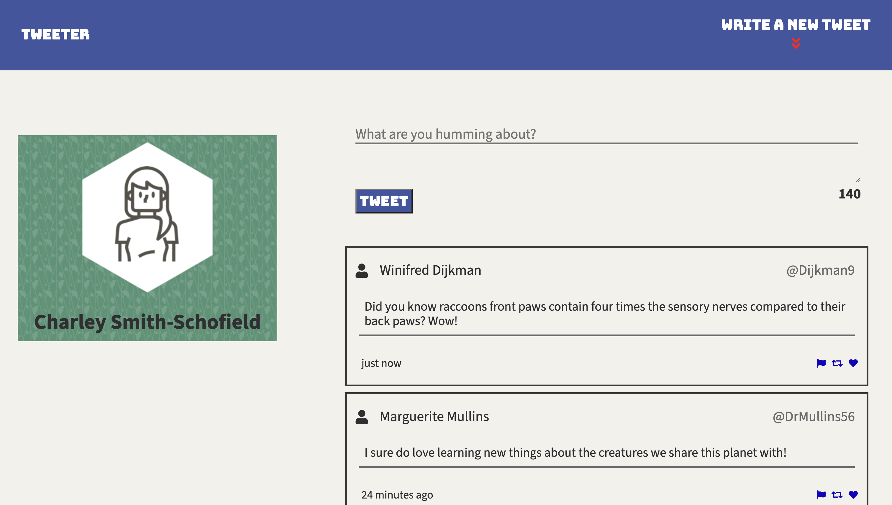
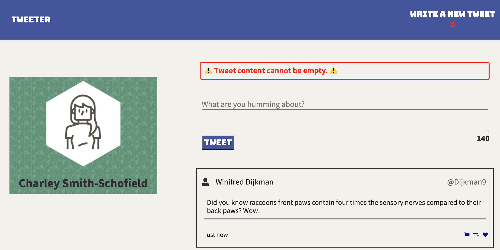
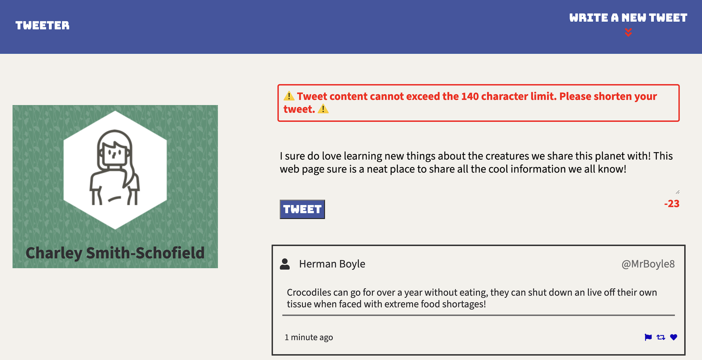

# Tweeter Project

Tweeter is a simple, single-page Twitter clone.

This repository is the starter code for the project: Students will fork and clone this repository, then build upon it to practice their HTML, CSS, JS, jQuery and AJAX front-end skills, and their Node, Express back-end skills.

## Getting Started

1. [Create](https://docs.github.com/en/repositories/creating-and-managing-repositories/creating-a-repository-from-a-template) a new repository using this repository as a template.
2. Clone your repository onto your local device.
3. Install dependencies using the `npm install` command.
3. Start the web server using the `npm run local` command. The app will be served at <http://localhost:8080/>.
4. Go to <http://localhost:8080/> in your browser.

## Dependencies

- Express
- Node (v5.10.x or above)
- body-parser: (^1.15.2)
- chance: (^1.0.2)
- express: (^4.13.4)
- fsevents: (^1.2.13)
- jquery: (^3.7.1)
- md5: (^2.1.0)

## Create New Tweets!

## Empty Tweets
#### Oh no it looks like you forgot to add content to your new tweet!
Don't worry Tweeter will let you know your tweet is empty.

## Long Tweets
#### No one likes a chatter-box! Try to keep things clear and concise. Tweeter will remind you to keep your tweets under 140 characters.
